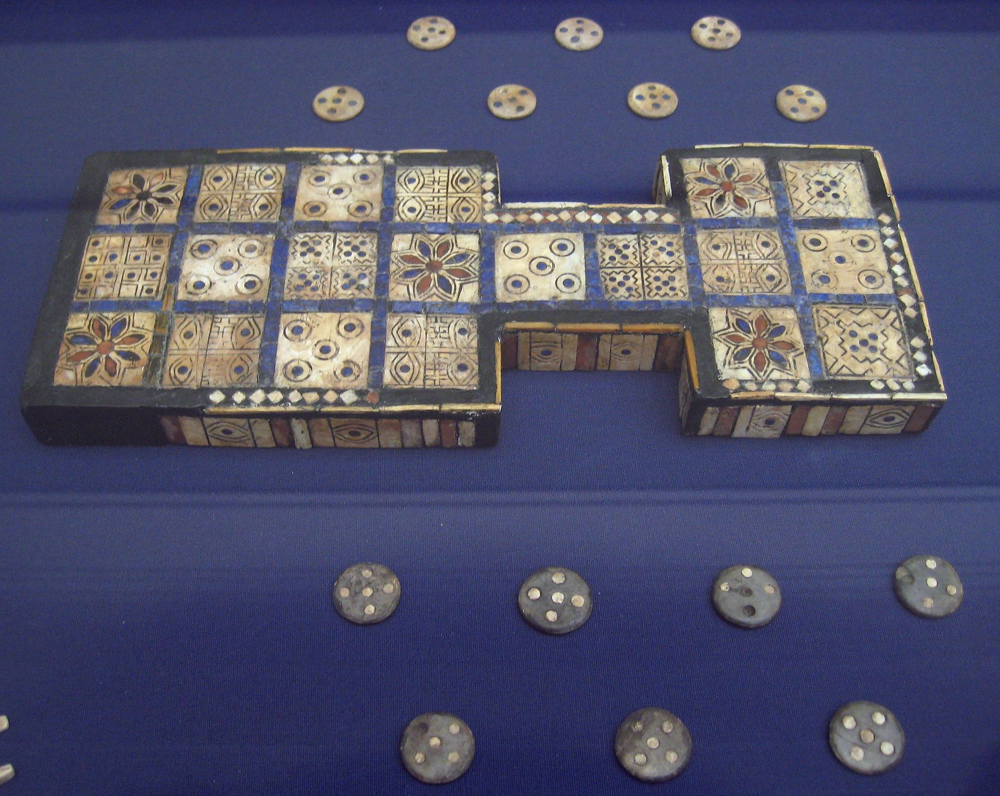

# Ur

> The Royal Game of Ur, also known as the Game of Twenty Squares or simply the Game of Ur, is a two-player strategy race board game that was first played in ancient Mesopotamia during the early third millennium BC.

---

Play [online](https://gameofur.azurewebsites.net).

---

- [Royal Game of Ur](https://en.wikipedia.org/wiki/Royal_Game_of_Ur)

Link: https://en.wikipedia.org/wiki/File:British_Museum_Royal_Game_of_Ur.jpg
